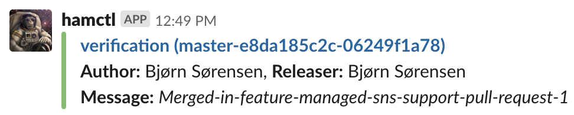
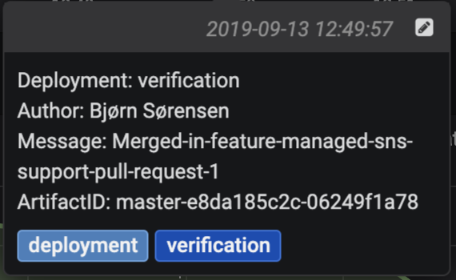
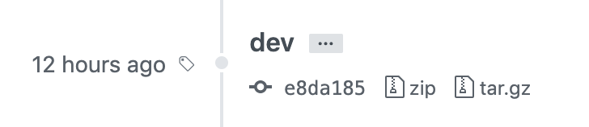

# Release Manager

[](https://travis-ci.com/lunarway/release-manager)
[](https://goreportcard.com/report/github.com/lunarway/release-manager)

GitOps release manager for kubernetes configuration repositories.

This project is used as an internal project at Lunar and it therefore contains some assumptions on our setup. This includes environment naming (dev, staging, prod), and also a specific check for @lunarway domains. Further it is build around assumptions made by our OSS project `shuttle`, and id's for releases are a combination of branch name, git-sha from source repo, and git-sha from shuttle plan repo. Our initial intent is not to support this as an open source project.

We will however, have it public available for reference. This might change over time.

# Design
The release-manager consist of 4 different "microservices" with each having a specific responsibility in the pipeline. The applications are basically utilities for moving files around a Git repository.
 The four applications are:

| Application | Description                                                                                                                                                          |
| ----------- | -------------------------------------------------------------------------------------------------------------------------------------------------------------------- |
| artifact    | a simple tool for generating an artifact.json blob with information from the CI pipeline                                                                             |
| server      | the API-server where clients (hamtcl) connects to, and daemon reports events to. It further implements different flows, e.g., promote a release, release an artifact |
| hamctl      | a CLI client for interacting with the release-manager server                                                                                                         |
| daemon      | a daemon reporting events about cluster component status back to the release-manager server                                                                          |

A simplified overview of all the components involved in the flow can be seen below:


The applications are not enough to complete the flow. We utilize jenkins as a CI server and Weaveworks Flux as a release operator running inside each cluster.

# Components

## Artifact
`artifact` is used to generate, what we refer to as artifacts. These are just a json-blob containing relevant information from the Continuous Integration flow.
As mentioned we use `shuttle` in our jenkins to minimize the custom "CI" code we have to write, making it portable, if we decide to change CI solution at some point. The id's of the artifacts, are composed of `<Branch>-<Source Repository>-<Plan Repository>`.

An example of a generated `artifact.json`
```json
{
  "id": "dev-0017d995e3-67e9d69164",
  "application": {
    "sha": "0017d995e32e3d1998395d971b969bcf682d2085",
    "authorName": "First Last",
    "authorEmail": "email@lunarway.com",
    "committerName": "First Last",
    "committerEmail": "email@lunarway.com",
    "message": "reformat something",
    "name": "lunar-way-example-service",
    "url": "https://bitbucket.org/LunarWay/lunar-way-example-service/commits/0017d995e32e3d1998395d971b969bcf682d2085",
    "provider": "BitBucket"
  },
  "ci": {
    "jobUrl": "https://jenkins.example.lunarway.com/job/bitbucket/job/lunar-way-example-service/job/dev/84/display/redirect",
    "start": "2019-03-29T13:47:15.259380775+01:00",
    "end": "2019-03-29T13:49:57.686299407+01:00"
  },
  "shuttle": {
    "plan": {
      "message": "fixes-a-bug-where-database-names-would-not-be-valid-if-services-have-more-than-one-dash-in-their-name",
      "url": "git://git@bitbucket.org:LunarWay/lw-shuttle-go-plan.git"
    }
  },
  "stages": [
    {
      "id": "build",
      "name": "Build",
      "data": {
        "dockerVersion": "18.09.3",
        "image": "quay.io/lunarway/example",
        "tag": "dev-0017d995e3-67e9d69164"
      }
    },
    {
      "id": "snyk-code",
      "name": "Security Scan - Code",
      "data": {
        "url": "https://app.snyk.io/org/squad-example/project/ID/history/ID",
        "vulnerabilities": {
          "high": 0,
          "low": 0,
          "medium": 0
        }
      }
    },
    {
      "id": "test",
      "name": "Test",
      "data": {
        "results": {
          "failed": 0,
          "passed": 173,
          "skipped": 0
        },
        "url": "https://jenkins.example.lunarway.com/job/bitbucket/job/lunar-way-example-service/job/dev/84/display/redirect"
      }
    },
    {
      "id": "push",
      "name": "Push",
      "data": {
        "dockerVersion": "18.09.3",
        "image": "quay.io/lunarway/example",
        "tag": "dev-0017d995e3-67e9d69164"
      }
    }
  ]
}
```

## Server

### Promote
The promotion flows, is a convetion based release process. It can be invoked by `hamctl` as follows:

```
$ hamctl promote --service example --env dev
```

The convention follows the following flow: `master -> dev -> staging -> prod`
As seen in the example above, the `example` service will be promoted from the lastest available artifact from `master` to the `dev` environment.

Another example, is a promotion of an artifact running in, e.g. staging, to the production environment. This can be achieved with the following command:

```
$ hamctl promote --service example --env prod
```
The above locates what is running in the `staging` environment, and takes the necessary steps to run the same artifact in `prod`.

### Release
The release flow, is a more liberal release process. There is no conventions in how artifacts move between environments. This makes it suitable for releasing `hotfix`-branches to production or `feature`-branches to a specific environment for testing before merging into `master`.

The release flow currently consist of two approaches, either the release of the lastest artifact from a given branch, or a specific artifact id.

Example of a release of a feature branch to the `dev` environment:

```
$ hamctl release --service example --branch "feature/new_feature" --env dev
```

Example of a release of a specific artifact id to the `staging` environment:

```
$ hamctl release --service example --artifact dev-0017d995e3-67e9d69164 --env staging
```

### Status

Status is a convience flow to display currently released artifact to the three different environments; `dev`, `staging`,`prod`.

```
$ hamctl status --service example

dev:
  Tag: master-1c1508405e-67e9d69164
  Author: Kasper Nissen
  Committer: Peter Petersen
  Message: empty-commit-to-test-flow
  Date: 2019-04-01 11:14:26 +0200 CEST
  Link: https://jenkins.example.lunarway.com/job/bitbucket/job/lunar-way-example-service/job/master/132/display/redirect
  Vulnerabilities: 0 high, 0 medium, 0 low

staging:
  Tag: master-1c1508405e-67e9d69164
  Author: Kasper Nissen
  Committer: Peter Petersen
  Message: empty-commit-to-test-flow
  Date: 2019-04-01 11:14:26 +0200 CEST
  Link: https://jenkins.example.lunarway.com/job/bitbucket/job/lunar-way-example-service/job/master/132/display/redirect
  Vulnerabilities: 0 high, 0 medium, 0 low

prod:
  Tag: master-8fgh08405e-67e9d69164
  Author: John John
  Committer: Hans Hansen
  Message: some-commit
  Date: 2019-04-01 11:14:26 +0200 CEST
  Link: https://jenkins.example.lunarway.com/job/bitbucket/job/lunar-way-example-service/job/master/132/display/redirect
  Vulnerabilities: 0 high, 0 medium, 0 low
````

### Policies

It is possible to configure policies for releases with `hamctl`'s `policy` command and globally with flags on the `server`.

You can `list`, `apply` and `delete` policies for a specific service like below.

```
$ hamctl policy --service <service> list
$ hamctl policy --service <service> apply <policy>
$ hamctl policy --service <service> delete <policy-id> [<policy-id>]
```

See below for details on how to apply specific policies.

Some policies cannot be applied simultaniously as they semantically does not support each other.
An example is an `auto-release` policy releasing a branch not compatible with a `branch-restriction` policy.
These cases are validated when applying either of them.

#### Auto-release artifacts from branches to environments

An `auto-release` policy instructs the release manager to deploy new artifacts from a specific branch into an environment.

Multiple policies can be applied for the same branch to different environments, e.g. release `master` artifacts to `dev` and `staging`.

This is an example of applying an auto-release policy for the product service for the `master` branch and `dev` environment.

```
$ hamctl policy --service example apply auto-release --branch master --env dev
```

#### Branch restriction on environments

A `branch-restriction` policy instructs the release manager to only allow artifacts from specific branches to be released to an environment.
The `--branch-regex` flag defines a regular expression that is matched against the branch name on every release.

As an example, the following command applies a branch-restriction policy for the `example` service that only allows the `master` branch to be released to the `prod` environment.

```
$ hamctl policy --service example apply branch-restriction --env prod --branch-regex '^master$'
```

Another example is to allow only `master` or `hostfix/*` branches in `prod` like this.

```
$ hamctl policy --service example apply branch-restriction --env prod --branch-regex '^(master|hotfix\/.+)$'
```

It is not possible to create an auto-release policy for a non-matching branch to an environment that is protected by a branch-restriction policy.

Be aware that the regular expression should be as strict as possible otherwise you might get unexpected results.
A branch regex like `master` will also allow branch names like `refactor-master-worker`, so make sure to mark the start `^` and end `$` of the string.

The `server` can also enforce branch restrictions on all managed services by setting the `policy-branch-restrictions` flag.
It takes a comma seprated list of `<environment>=<branchRegex>` values.

```
$ server start --policy-branch-restrictions 'production=^master$,staging=^staging$'
```

They will be visible with `hamctl policy list` but cannot by removed with `hamctl`.
It is also not possible to overwrite them with custom policies, e.g. changing branch of a globally restricted environment.

### Notifications

When releasing applications the server will notify different upstream services along with outputting an identifiable log useful for log aggregation statistics.

```
info  command/start.go:145  Release [dev]: verification (master-e8da185c2c-06249f1a78) by Bjørn Sørensen, author Bjørn Sørensen
```

A Slack message is pushed to a `#releases-<env>` Slack channel.



Grafana is annotated with release metadata and tag `deployment`.



If the artifact provider is GitHub and a GitHub API token is provided (`--github-api-token`) the application source repository is tagged with `<env>` on the released Git SHA.



### Tracing support

The server collects [Jaeger](https://www.jaegertracing.io/) spans. This is enabled by default and reported as service `release-manager`.
The jaeger configuration can be customized with available [environment variables](https://github.com/jaegertracing/jaeger-client-go#environment-variables).

For local development a jaeger all-in-one instance can be created with Docker running `make jaeger`.
The Jaeger UI will be available on [`localhost:16686`](http://localhost:16686).

To disable collection set `JAEGER_DISABLED=true`.

## hamctl

`hamctl` is a thin CLI for interacting with the release-manager server. The different commands implemented in `hamctl` is visible in the previous section.

`hamctl` uses a token-based authentication model for interacting with the release-manager. This can either be provided as command-line argument `--http-auth-token` og set using a ENV variable: `HAMCTL_AUTH_TOKEN`.

### Completions

Shell completions are available with the command `completion`.
The following commands will add completions to the current shell in either bash or zsh.

```
source <(hamctl completion bash)
source <(hamctl completion zsh)
```

For a more detailed installation instruction see the help output.

```
hamctl completion --help
```

## daemon

`daemon` is a small controller running in each of the environments and reports state changes in the environment back to the release-manager. `daemon` needs access to the kubernetes api server, and can be configured using a `ServiceAccount`.

`daemon` uses a token-based authentication model for interacting with the release-manager. This token can be set using the command-line argument `--auth-token` or the ENV variable: `HAMCTL_AUTH_TOKEN`


# Directory structure

Files are structured as shown below.

Artifacts are stored in the `artifacts` directory.
It contains artifacts based of Git branches on the application repositories and must contain resource definitions for the environments that it is able to be released to.

In the root are folders for each environment, e.g. `dev`, `prod`.
These folders contain a `releases` directory with kubernetes resource definitions of each namespace and their running applications.
Provisioning setup resources are like wise stored here, e.g. kops yaml resources.

A `policies` directory holds all recorded release policies.
These are stored as JSON files for each service.

```
.
├── policies
│   └── <service>.json
├── artifacts
│   └── <service>
│       ├── <branches>
│       └── master
│           ├── artifact.json
│           ├── <environment>
│           └── dev
│               ├── 01-configmap.yaml
│               ├── 02-db-configmap.yaml
│               ├── 40-deployment.yaml
│               └── 50-service.yaml
├── <environments>
└── dev
    ├── provisioning
    └── releases
        ├── <namespaces>
        └── dev
            └── <service>
                ├── artifact.json
                ├── 01-configmap.yaml
                ├── 02-db-configmap.yaml
                ├── 40-deployment.yaml
                └── 50-service.yaml
```

When running `kubectl apply` files are applied to the cluster alphabetically so the following convention should be used by configuration generators.

```
00 CRDs
01-09 configmaps
10-19 secrets
20-29 volumes
30-39 rbac
40-49 deployments/daemonsets
50-59 service
60-69 ingress
```

Resources starting with `00_` will skip resource validation. CustomResourceDefintions does not work with the used resource validation, thus they should always start with `00_`.

# Installation

## Access to the config repository
The release manager needs read/write permissions to the config repo.

To create a secret that the release manager can consume: (expects that the filename is identity)

```
kubectl create secret generic release-manager-git-deploy --from-file=identity=key
```

This secret should be mounted to `/etc/release-manager/ssh`

# Development

The `Makefile` exposes targets for building, testing and deploying the release manager and its CLIs.
See it for details.

The most common operations are build and tests.

```
$ make build
go build -o dist/hamctl ./cmd/hamctl
go build -o dist/server ./cmd/server
go build -o dist/artifact ./cmd/artifact

$ make build_server
go build -o dist/server ./cmd/server

$ make test
go test -v ./...
```

## e2e setup

To help development it is possible to use the e2e setup.

This setup is based a kubernetes cluster managed by `kind`. The following resources is setup up

| Name              | Description                                                                                                                                                                                                                                                                                                  |
| ----------------- | ------------------------------------------------------------------------------------------------------------------------------------------------------------------------------------------------------------------------------------------------------------------------------------------------------------ |
| `source-git-repo` | A local git repository in `e2e-test/source-git-repo` that is used as the config repository.                                                                                                                                                                                                                  |
| `fluxd`           | The fluxd service inside the k8s cluster, which is connected to the `source-git-repo`. It is polling the repo for changes every 5s, so it triggers as soon as a commit is done in `source-git-repo`, like a webhook from github normally would. Additionally fluxd is setup to `--connect` to release-daemon |
| `release-daemon`  | A locally built binary of the release-daemon, but running inside the k8s cluster. The binary is mounted from local `e2e-test/binaries` for quick rebuild, so the pod can just be restarted while developing. This is done using the **rebuild** or **watch** actions.                                        |
| `release-server`  | A locally built binary of the release-daemon, that is running in the same manner as the `release-daemon`                                                                                                                                                                                                     |
| `rabbitmq`        | A simply setup rabbitmq server for the release-manager                                                                                                                                                                                                                                                       |

### e2e actions

To use the e2e setup there are the following actions supported:

| Action                   | Command                          | Description                                                                                          |
| ------------------------ | -------------------------------- | ---------------------------------------------------------------------------------------------------- |
| Start e2e setup          | `make e2e-setup`                 | Start and initiate kind and e2e setup                                                                |
| Rebuild manager          | `make e2e-rebuild-local-manager` | Rebuild the manager and restart pod in e2e cluster                                                   |
| Rebuild daemon           | `make e2e-rebuild-local-daemon`  | Like "Rebuild manager" but for the daemon                                                            |
| Watch manager            | `make e2e-rebuild-local-manager` | Watch source code changes and rebuild the manager and restart pod in e2e cluster. Requires `nodemon` |
| Watch daemon             | `make e2e-rebuild-local-daemon`  | Like "Watch manager" but for the daemon                                                              |
| Do dummy release         | `make e2e-do-release`            | Do a release in git repo to trigger fluxd change                                                     |
| Do failing dummy release | `make e2e-do-bad-release`        | Do a bad release in git repo to trigger fluxd error                                                  |
| Do another dummy release | `make e2e-do-another-release`    | Do another kind of release in git repo to trigger fluxd change                                       |
| Stop e2e setup           | `make e2e-teardown`              | Stop and cleanup the e2e setup                                                                       |


# Release

There are multiple applications in this repo.

This project is configured with `goreleaser` and releases all 4 applications at once.

The release-manager server and the release-daemon is available as docker images, besides raw binaries.
